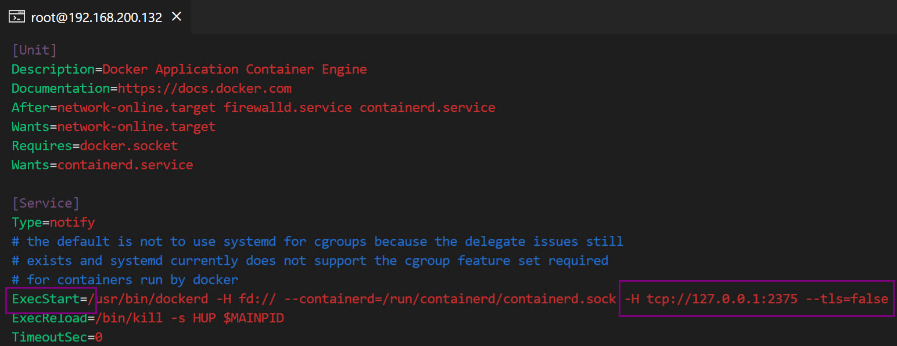

# Docker

**When do you need this extension**?

Microsoft provides an extension for Docker, but it can only connect to the local docker. When you need to manage Docker on multiple servers, it is powerless. At this time, this extension can help you do it.

**Steps**:

Docker provides a management http interface, it is disabled by default, you need to manually enable it.

1. Edit docker service: `vim /usr/lib/systemd/system/docker.service`, Find ExecStart, add `-H tcp://127.0.0.1:2375 --tls=false` at the end of the line
2. Restart docker: `systemctl daemon-reload && systemctl restart docker`

For remote dockers, you should always connect via ssh tunnel to ensure security.

