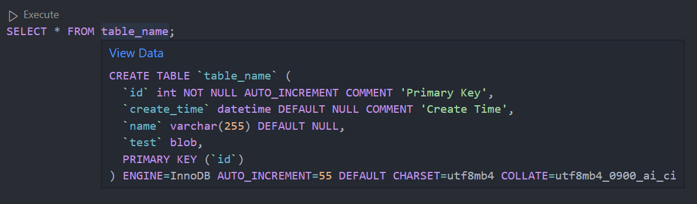

# SQL

## 执行

点击数据库节点的 `Open Query` 按钮.

将会打开和当前数据库绑定的SQL编辑器, 提供以下功能

1. SQL自动补全.
2. snippets: `sel、del、ins、upd、joi, selc.`
3. 执行已选择或当前光标SQL (快捷键: Ctrl+Enter).
4. 执行全部SQL (快捷键: Ctrl+Shift+Enter).

该扩展支持了codelen, 但不支持存储过程和函数, 如果你经常使用他们, 则建议禁用codelen.

## 表定义

当你将鼠标移动到表的上面时, 可以显示表的创建语句, 或者使用alt+enter快捷键通过Code Action的方式操作(即DDL, 只支持非隐藏表)

