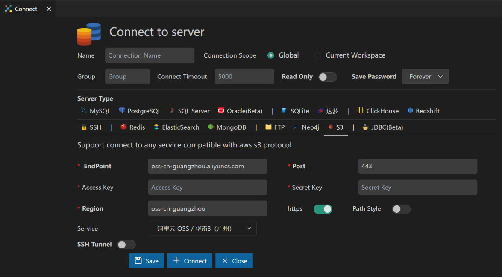
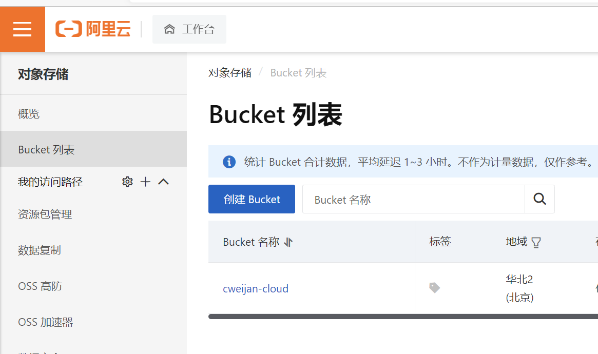
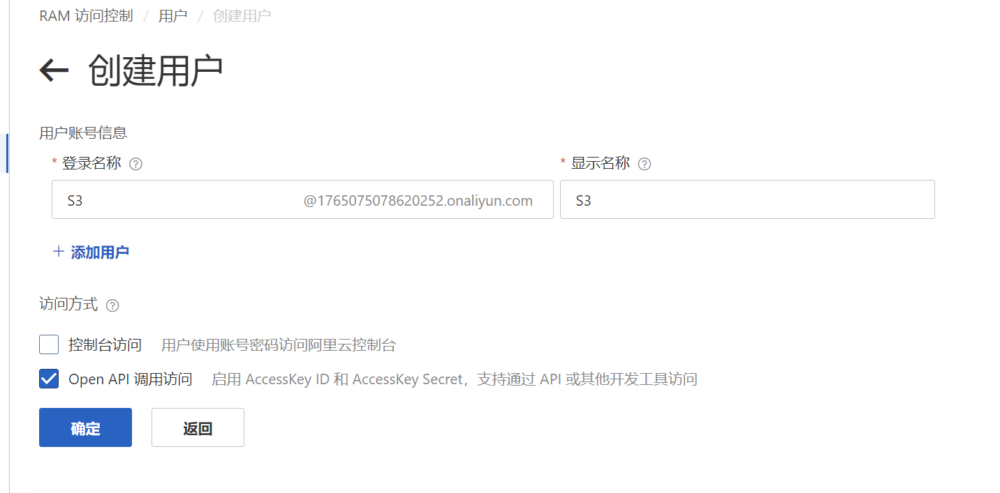
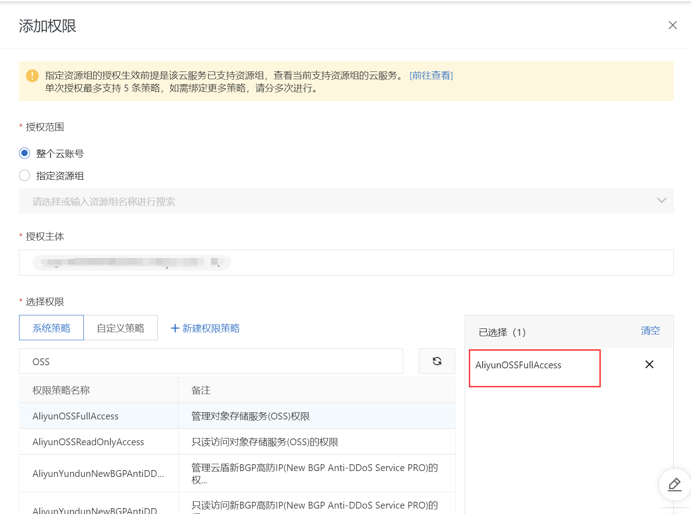
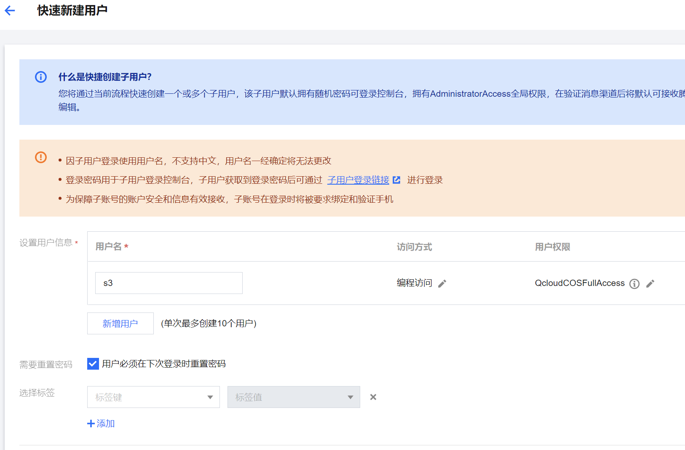

# 私人网盘

从版本5.5.4后支持连接到兼容aws s3协议的服务, 常见的有[阿里云OSS](#阿里云), [腾讯云COS](#腾讯云)等等, 通过该扩展连接对象存储服务, 就可视为连接到一个私人网盘.

使用步骤:

* 开通对象存储服务, 存储成本一般是0.12元/G/月, 下载带宽费用0.5元/G(或者用开源的minio搭建完全免费的私人服务器)
* 获取对象存储服务的access key和secret key.
* 打开连接界面, 创建一个s3连接.

连接效果

# 对象存储服务开通帮助

## 阿里云

开通步骤:

1. 开通[OSS服务](https://oss.console.aliyun.com/), 选择Bucket列表, 创建一个Bucket 
2. 进入子账号管理, [RAM 访问控制 (aliyun.com)](https://ram.console.aliyun.com/users), 创建一个用户, 选择Open API调用访问 , 创建完成后保存**AccessKey**和**Secret**
3. 为这个用户配置AliyunOSSFullAccess的权限

## 腾讯云

开通步骤:

1. 开通[COS服务](https://console.cloud.tencent.com/cos), 选择存储桶列表, 创建一个存储桶
2. 进入子账号管理, [用户 - 控制台 (tencent.com)](https://console.cloud.tencent.com/cam), 创建一个用户, 选择快速新建用户, 配置访问方式为**编程访问**, 用户权限为**QcloudCOSFullAccess**, 创建完成后保存**AccessKey**和**Secret**
